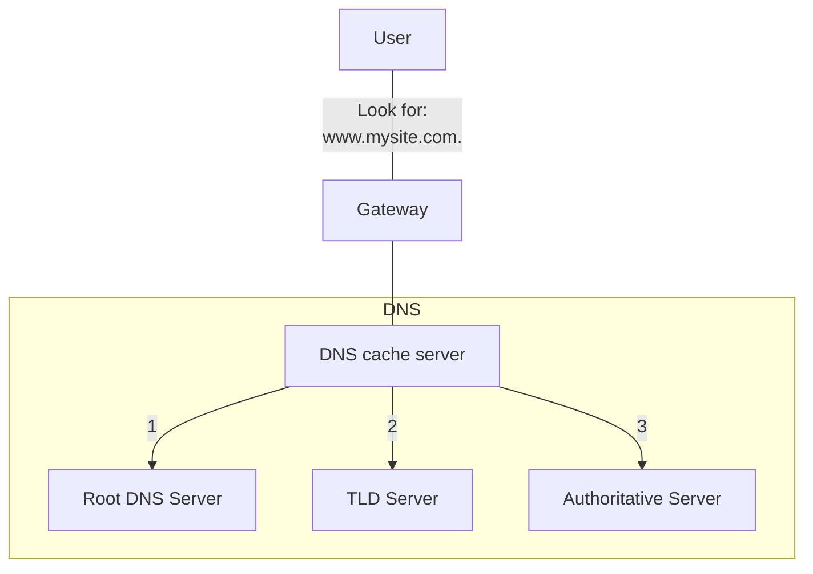

# DNS Message Format

The DNS server stores different types of resource records that are used to resolve names. These records contain the name, address, and type of record. Some of these record types are as follows:

- Forward lookup zone, translate an IP address in a symbolic name
	- **A** - An end device IPv4 address
	- **NS** - An authoritative name server
	- **AAAA** - An end device IPv6 address (pronounced quad-A)
	- **SRV** - describe services
	- **NS** - Name Server, resolve the records for the DNS
	- **MX** - A mail exchange record
- Reverse lookup zone
	- **PTR**: Pointer record, translate an IP address in a name

# Types

- Private: 

## Public

Hierarchical level.
The ==naming structure is broken down== into small zones. Each DNS server maintains a specific database file and is only responsible for managing name-to-IP mappings for that small portion of the entire DNS structure.

Each zone is called **level**. The ==left-most level is the **top-level domain**==.

When a device requires a DNS service, it contacts a DNS cache server. If the server has the cache for the resolution, it sends back the answer. Otherwise it contacts other DNS instances in a specific order.



- **Root DNS Server**: has the resolutions for all the top-level domain. 
- **TLD Server**: has partial resolution for the required site name.
- **Authoritative Server**: has the full resolution for the required site name.

```ad-note
title: Cache

Memorisation of a previous positive operation. Held by both clients and servers. The duration of the cache is determined by the TTL.
```

# Split Horizon DNS

In case of multiple possible resolutions for a **DNS name resolution**, the authoritative DNS Servers (that use the Split Horizon) redirect the client to the closest provider DNS available.

# Anycast IP

System to redirect clients to the closest **IP address** available.

# Zones and Records
