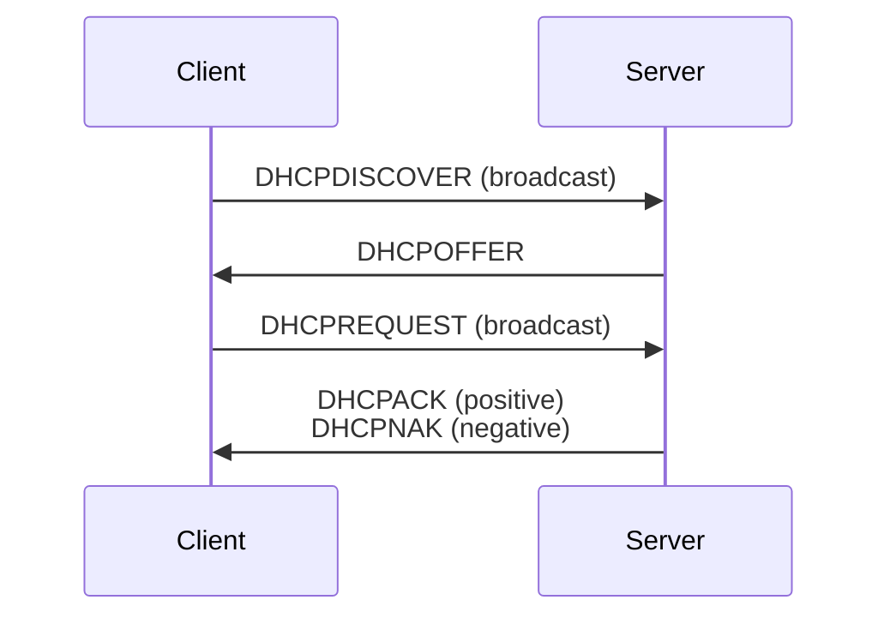

UDP: 67 (server), 68 (client) ports

Usually provides addresses, subnet masks, gateways and a DNS server address.

1. **Client**: Broadcast a DHCP Discover message to identify available DHCP Serves on the network
2. **Server**: Reply with DHCP Offer message to offer a **lease**.
3. **Client**: Broadcast a DHCP Request that identifies the DHCP Server and relative **lease** accepted.
4. **(Optional) Client**: When the lease reaches the half-time, send a DHCP Renew to renew the assigned address.
5. **Server**
	- *Offer still available*: Send a DHCP Acknowledgement message to confirm to the client that the request has been finalised.
	- *Offer no longer valid*: The selected server sends a DHCP Negative Acknowledgement message to signal to the client to resend a DHCPDISCOVER.

```ad-note
title: Lease
Contains the IPv4 address and subnet mask for the client, and IPv4 address of the default gateway. It includes also the duration of the lease.
```



```ad-info
title: DHCP Reservation

The Server DHCP keeps an IP for a client device with a specific MAC address. Useful for manage great number of routers, devices that don't support dynamic IP or fixed devices.
```
^DHCP-Reselvation

# DHCP Server Malfunction

In case of DCHP malfunction (error, DHCP pool exhausted, etc.), the devices uses the system [APIPA](Public%20and%20Private%20Addresses.md#Special%20Addresses) using an IP of the subnet 162.254.0.0/16.

# Characteristics

- **DHCP Pool**: pool of assignable addresses
- **Lease Time**: lifetime of an assigned address
- **Options**: gateway assignment, default domain name, other options
- **Static Lease (reservations)**: see [DHCP Reservation](#^DHCP-Reselvation)
- **Relay**: service to provide DHCP assignment when a DCHP Server is not in the same network. Centralisation of DHCP Servers