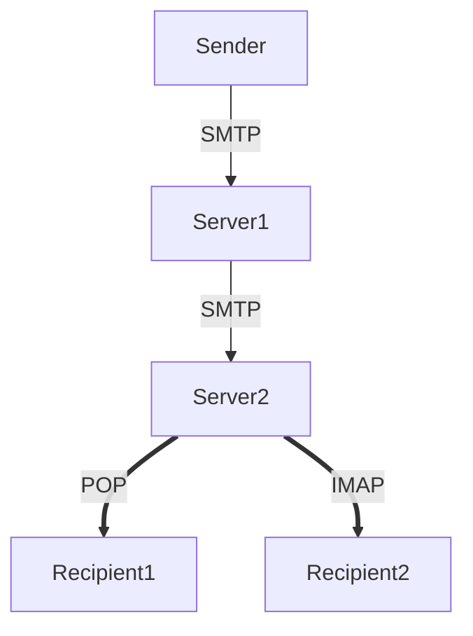

# Simple Mail Transfer Protocol (SMTP)

Resolve the mail address with the [DNS](Domain%20Name%20System.md) with the method [MX](Domain%20Name%20System.md#Zone).

It sends a message containing **header** and **body**.

# Post Office Protocol (POP)

It retrieves a received mail from a mail server. It removes the mail from the mail provides server to put it the client. So ==it doesn't store the mail on the server==.

It uses [TCP](Transmission%20Control%20Protocol%20(TCP).md) on the port 110 (client connections).

```ad-note
title: Protocol in PULL

Is the client that asks the server if there is a mail for them. The mail is not kept on the server once taken.
```

# IMAP

Unlike [POP](#Post%20Office%20Protocol%20(POP)), when the user connects to an IMAP-capable server, copies of the messages are downloaded to the client application. The original messages are kept on the server until manually deleted: ==it syncs the local mail storage with the IMAP server==.

Users can create a file hierarchy on the server to organise and store mail. That file structure is duplicated on the email client as well.

```ad-note
title: Protocol in PUSH

The server sends a copy of the mail to the client.
```


