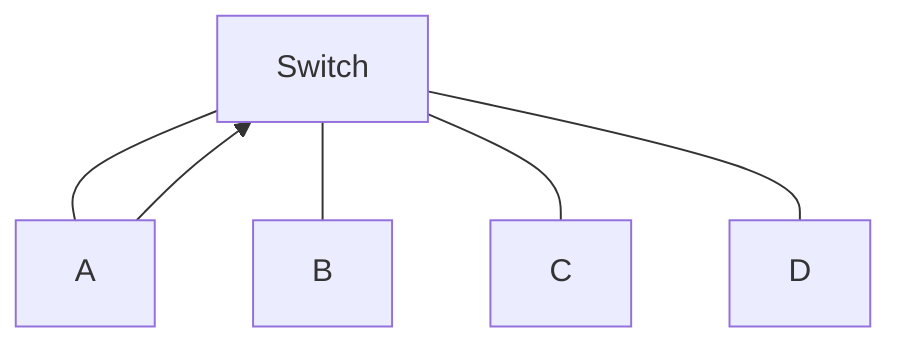
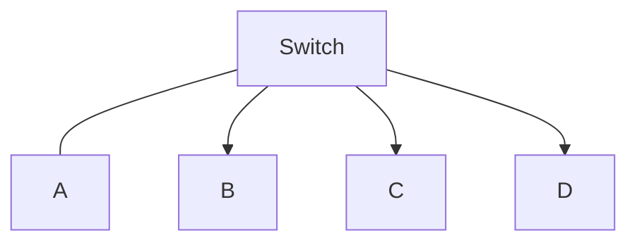
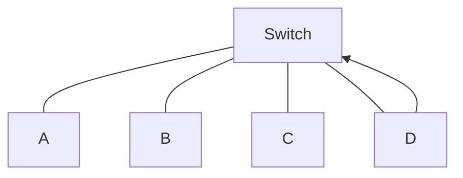
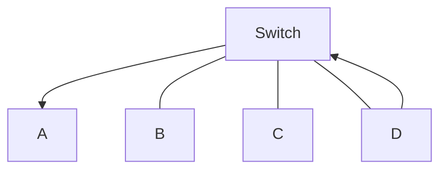

# MAC Address

```ad-abstract
An Ethernet MAC address is a 48-bit address expressed using 12 hexadecimal digits. Because a byte equals 8 bits, we can also say that a MAC address is 6 bytes in length.
```

A MAC Address is divided into:

- Organizationally Unique Identifier (OUI): 3 hexadecimal digits
- Vendor Assigned: 3 hexadecimal digits

# MAC Address Table

At factory setup, a switch has a empty table (MAC Address Table) that fills in when a device is connected to the switch.
The MAC table is located in the RAM.
The elements inserted into the table by learning-flooding method are called ==dynamic==. If the electricity is cut off from the Switch's port, the element in that table is deleted by the process of ==aging==.

#### 1. Learning Phase

In Learning phase, the switch receives the message from an end device sender.

| Port | MAC Address |
| ---- | ------------|
| 1    | 00-0A       |
|      |             |



#### 2. Forward Phase

Then it sends the message in Forward phase along every powered port (excluded the sender's one).

| Port | MAC Address |
| ---- | ------------|
| 1    | 00-0A       |
|      |             |



#### 3. Filtering Frames

The roles of sender and receiver now switch places: the receiver sends a message to the original sender, the Switch knows already the MAC address of the first device and uses just the interested ports for the communication.

| Port | MAC Address |
| ---- | ----------- |
| 1    | 00-0A       |
| 4    | 00-0D       |





# Switch Speed and Forwarding Methods

Switches use one of the following forwarding methods for switching data between network ports:

- **Store-and-forward switching**: receives the entire frame and computes the CRC. CRC uses a mathematical formula, based on the number of bits (1s) in the frame, to determine whether the received frame has an error. If the CRC is valid, the switch looks up the destination address, which determines the outgoing interface. Then the frame is forwarded out of the correct port.
- **Cut-through switching**: This frame forwarding method forwards the frame before it is entirely received. At a minimum, the destination address of the frame must be read before the frame can be forwarded.
	- **Fast forward switching
	- **Fragment free switching

## Memory Buffering

- **Port-based memory**: Each port has a set amount of RAM it may use
- **Shared memory**: The Switch manages how much memory is used by the single ports
