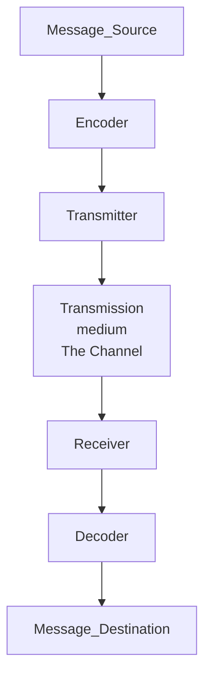

```ad-abstract

One of the first steps to sending a message is encoding. Encoding is the process of converting information into another acceptable form, for transmission. Decoding reverses this process to interpret the information.
```

It converts the information into the proper form of transmission.