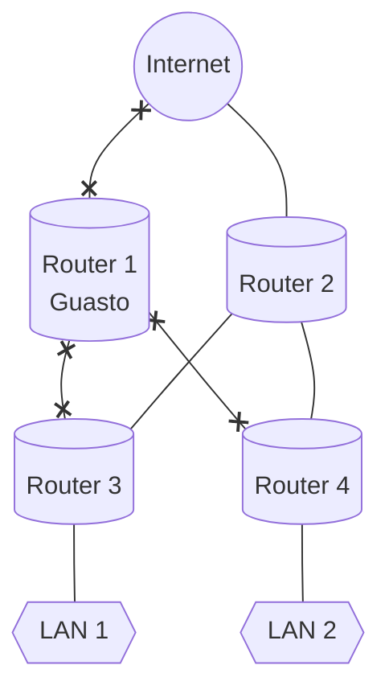
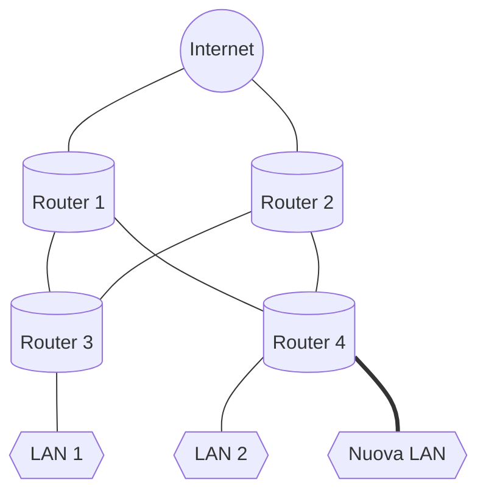
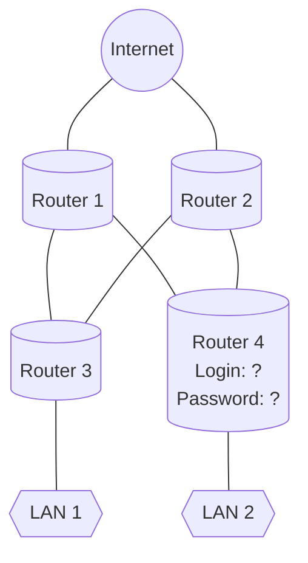

# Tolleranza ai Guasti

Una rete con **tolleranza ai guasti** è quella che limita il numero di dispositivi interessati durante un guasto. Queste reti dipendono da più percorsi tra l'origine e la destinazione di un messaggio. Se un percorso fallisce, i messaggi vengono inviati immediatamente su un collegamento diverso. 

L'implementazione di una rete packet-switched è un modo in cui le reti affidabili forniscono ridondanza.

# Scalabilità

Una rete **scalabile** si espande rapidamente per supportare nuovi utenti e applicazioni. Lo fa senza degradare le prestazioni dei servizi a cui accedono gli utenti esistenti.

# Quality of Service

Con la convergenza di dati, voce e contenuti video sulla stessa rete, la **QoS** diventa un meccanismo fondamentale per gestire la congestione e garantire la distribuzione affidabile dei contenuti a tutti gli utenti.

La congestione si verifica quando la domanda di larghezza di banda supera la quantità disponibile.

Quando il volume del traffico è maggiore di quello che può essere trasportato attraverso la rete, i dispositivi manterranno i pacchetti in memoria finché le risorse non saranno disponibili per trasmetterli. Con una policy QoS in atto, il router può gestire il flusso di dati e il traffico vocale, ==dando priorità alle comunicazioni vocali== se la rete è soggetta a congestione.

# Sicurezza

La protezione dell'infrastruttura di rete include la protezione fisica dei dispositivi che forniscono connettività di rete e la prevenzione dell'accesso non autorizzato al software di gestione che risiede su di essi.

I requisiti di una rete sicura sono:

- **Riservatezza** - La riservatezza dei dati significa che solo i destinatari previsti e autorizzati possono accedere ai dati e leggerli.
- **Integrità** - L'integrità dei dati assicura che le informazioni non siano state alterate durante la trasmissione, nel percorso dall'origine alla destinazione.
- **Disponibilità** - Con disponibilità dei dati si intende la garanzia di un accesso ai servizi dati in modo tempestivo e affidabile per gli utenti autorizzati.
