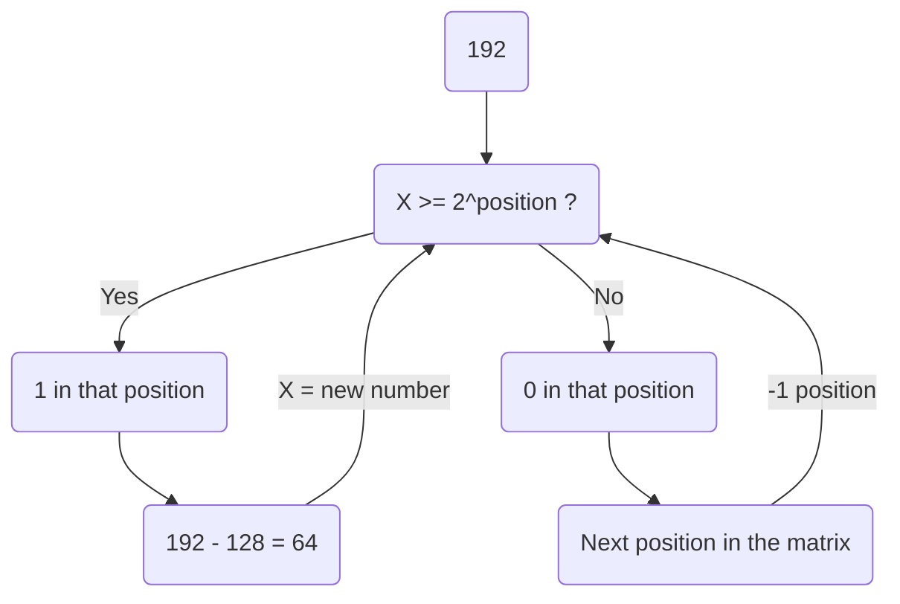

# Basic Form

| Number   |     |     |     |
| -------- | --- |:---:|:---:|
| Digit    | 3rd | 2nd | 1st |
| Formulae | X^3 | X^1 | X^0 |

X = possible number of digits in the system

```decimal
25	= (2*10^1) + (5*10^0)
	= (2*10) + (5*1)
	= 20 + 5
```

# Binary System

| 2^7 | 2^6 | 2^5 | 2^4 | 2^3 | 2^2 | 2^1 | 2^0 |
| :-: | :-: | :-: | :-: | :-: | :-: | :-: | :-: |
| 128 |  64 |  32 |  16 |  8  |  4  |  2  |  1  |

## IP Addresses

The values range with 8 digits in binary is from 0 to 255.

192.168.1.2

| 192 |  .  | 168 |  .  | 001 |  .  | 002 |
|:---:|:---:|:---:|:---:|:---:|:---:|:---:|

# Conversions

## Binary/Hexadecimal to Decimal

```binary
101 = 1*2^2 + 0*2^1 + 1*2^0
	= 4 + 0 1 = 5
```

```hex
0A3 = 0*16^2 + A*16^1 + 3*16^0
	= 0 + A(10)*16 + 3
	= 0 + 160 + 3 = 163
```

## Decimal to Binary

| 2^7 | 2^6 | 2^5 | 2^4 | 2^3 | 2^2 | 2^1 | 2^0 |
| :-: | :-: | :-: | :-: | :-: | :-: | :-: | :-: |
| 128 |  64 |  32 |  16 |  8  |  4  |  2  |  1  |



# Conversion Tables

| Decimal | Binary | Hex |
|:-------:|:------:|:---:|
|    0    |  0000  |  0  |
|    1    |  0001  |  1  |
|    2    |  0010  |  2  |
|    3    |  0011  |  3  |
|    4    |  0100  |  4  |
|    5    |  0101  |  5  |
|    6    |  0110  |  6  |
|    7    |  0111  |  7  |
|    8    |  1000  |  8  |
|    9    |  1001  |  9  |
|   10    |  1010  |  A  |
|   11    |  1011  |  B  |
|   12    |  1100  |  C  |
|   13    |  1101  |  D  |
|   14    |  1110  |  E  |
|   15    |  1111  |  F  | 
