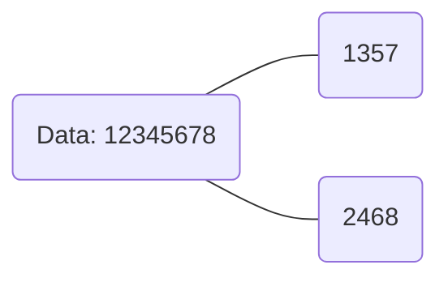
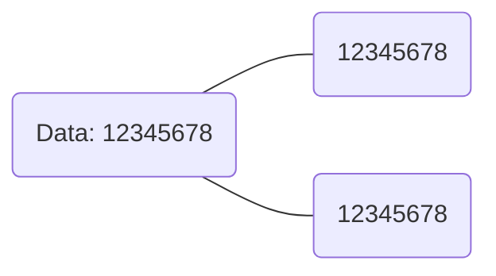
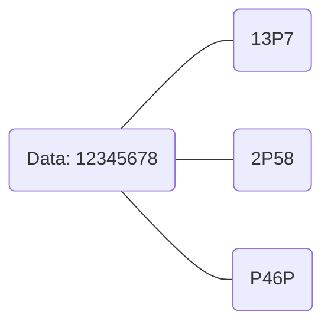
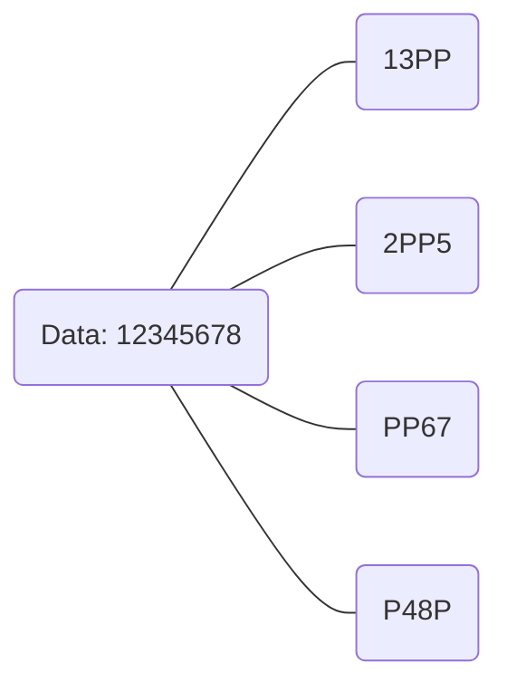
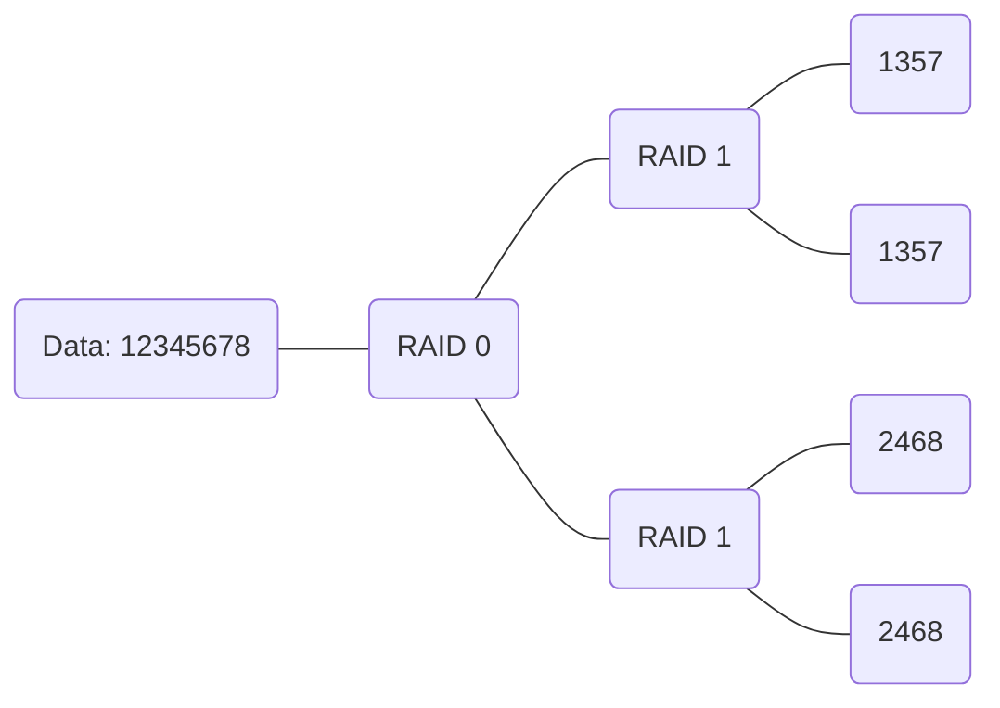
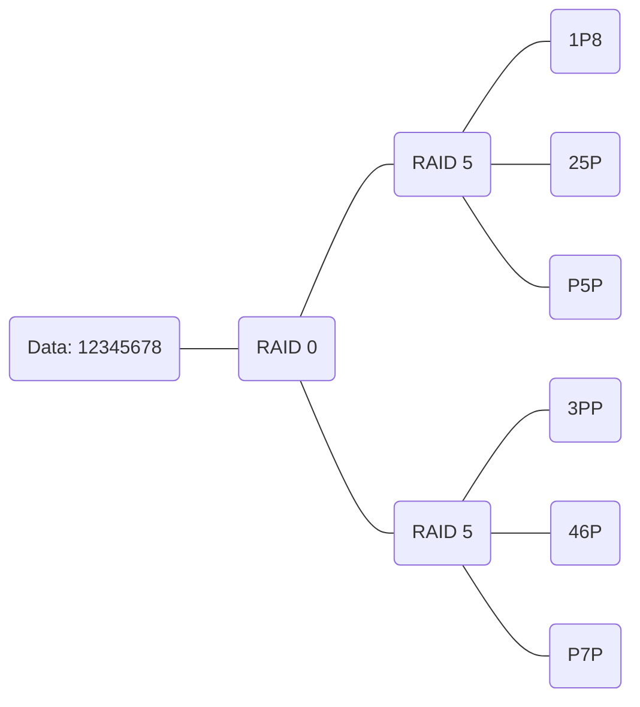
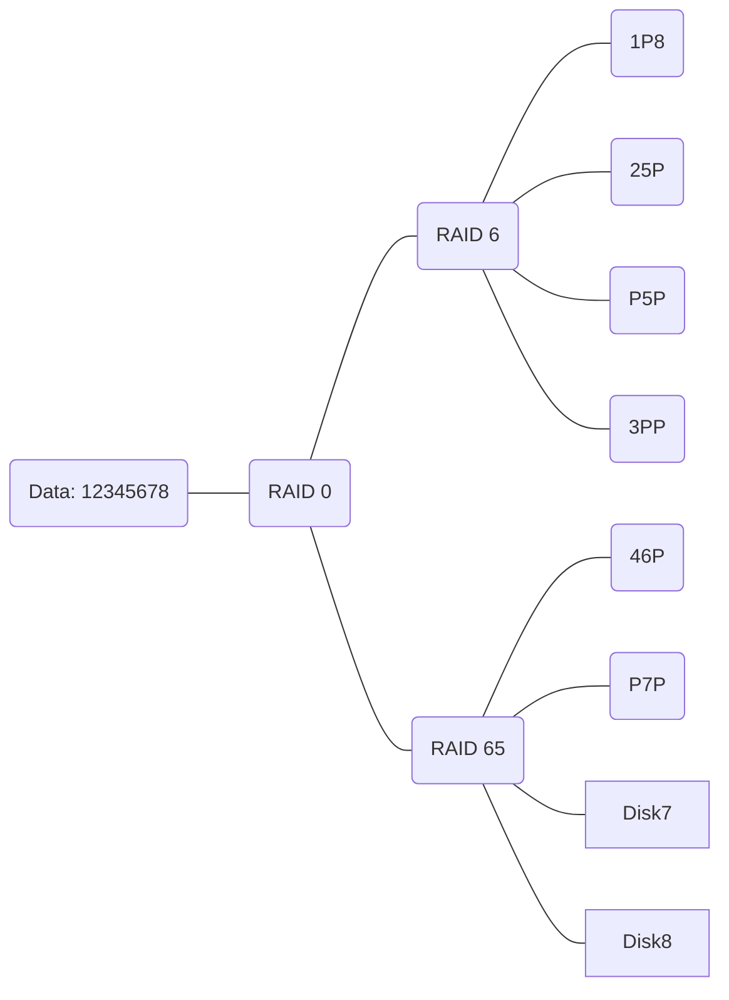

Redundancy: RAID

```ad-note
title: Hardware RAID

Usage of a device that manages multiple disks to provide to a PC (**Controller**). The PC will see all of these disks as one.
```

```ad-note
title: Software RAID

The PC itself manages multiple disks.
```

```ad-warning
RAID is not a [Backup](Backup.md) system.
```

Provides either speed or security

# Levels

0. **Striping**: Divides the data. *Speed*.



1. **Mirroring**: Clones a disk. *Security*.



5. **Parity**: Divides the data between multiple disks alongside the function XOR. *Speed and Security*.



6. **Dual Parity**: Like **Parity** but with two parity disks. *Speed and Security*.



10. **Strip Mirror**: Two pairs of **Mirror** disks in **Striping**. *Speed and Security*.



50. : Clusters of 3 **Parity** disks in **Striping**. *Speed and Security*.



60. : Cluster of 4 **Dual Parity** disks in **Striping**. *Speed and Security*.



| RAID | Min Disks | Max Disks  |    Volume    |      Fault Tolerance      |
|:----:|:---------:|:----------:|:------------:|:-------------------------:|
|  0   |     2     |     2      |   disk * 2   |             1             |
|  1   |     2     |     2      |     disk     |             -             |
|  5   |     3     |    inf     | disk * (n-1) |             1             |
|  6   |     4     |    inf     | disk * (n-2) |             2             |
|  10  |     4     |     4      |   disk / 2   | 2 (not in the same group) |
|  50  |     6     | inf (even) | disk * (n-3) |                           |
|  60  |     8     | inf (even) | disk * (n-4) |                           |


