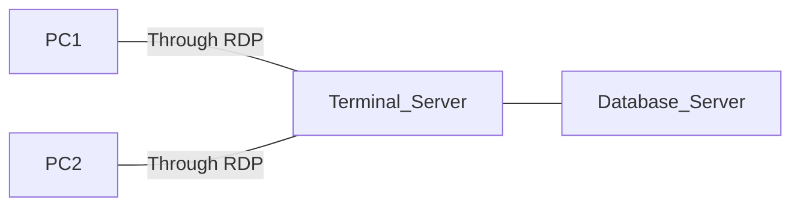

# Remote Desktop Protocol ([RDP](Remote%20Desktop%20Protocol.md))

Port TCP 3389

Doesn't have screen sharing and needs network configuration. Single user, either

# Virtual Network Console ([VNC](Virtual%20Network%20Console.md))

Port TCP 5900

Allows screen sharing but needs network configuration.

# Third Parties Software

Usually paid, only output traffic, don't need network configuration.