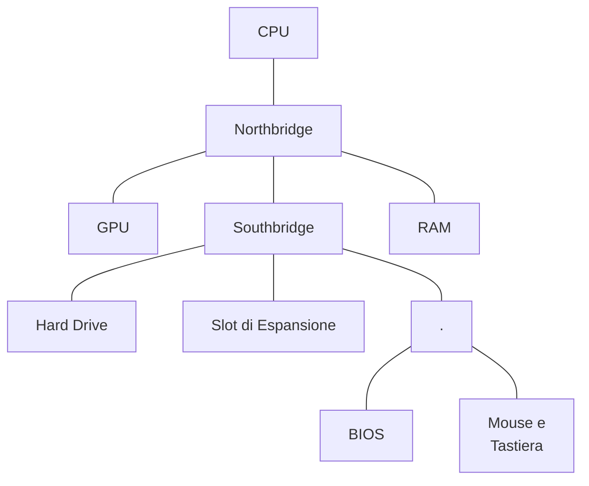

# Connessioni componenti

```mermaid
flowchart TD

CPU --- Northbridge
Northbridge --- GPU & Southbridge & RAM
Southbridge --- Hard_Drive["Hard Drive"] & Slot_Espansione["Slot di Espansione"] & .
. --- BIOS & Mouse_Tastiera["Mouse e<br>Tastiera"]
```
