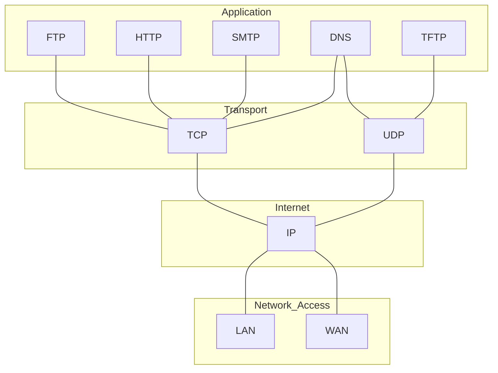

7. Application
6. Presentation
5. Session
4. --> **Transport**
3. Network
2. Data link
1. Physical

From this layer, all operations are made IN the device, between applications IN the device.

The transport layer includes two protocols:

- [[Transmission Control Protocol (TCP)]]
- [[User Datagram Protocol (UDP)]]



# Responsibilities

- Tracking Individual Conversations
- Segmenting Data and Reassembling Segments
- Add Header Information
- Identifying the Applications
- Conversation Multiplexing

# Port Numbers

Source ports and Destination ports indicates from and where to the data are routed.

## Socket

Is the union of the IP address and Port number, one for sender and one for destination.

```ad-example
192.168.0.2:netbios-ssn
```

## Groups

| Port Group                   | Number Range    | Description |
| ---------------------------- | --------------- | ----------- |
| Well-known Ports             | 0 - 1.023       |             |
| Registered Ports             | 1024 - 46.151   |             |
| Private and/or Dynamic Ports | 49.152 - 65.353 |             |


