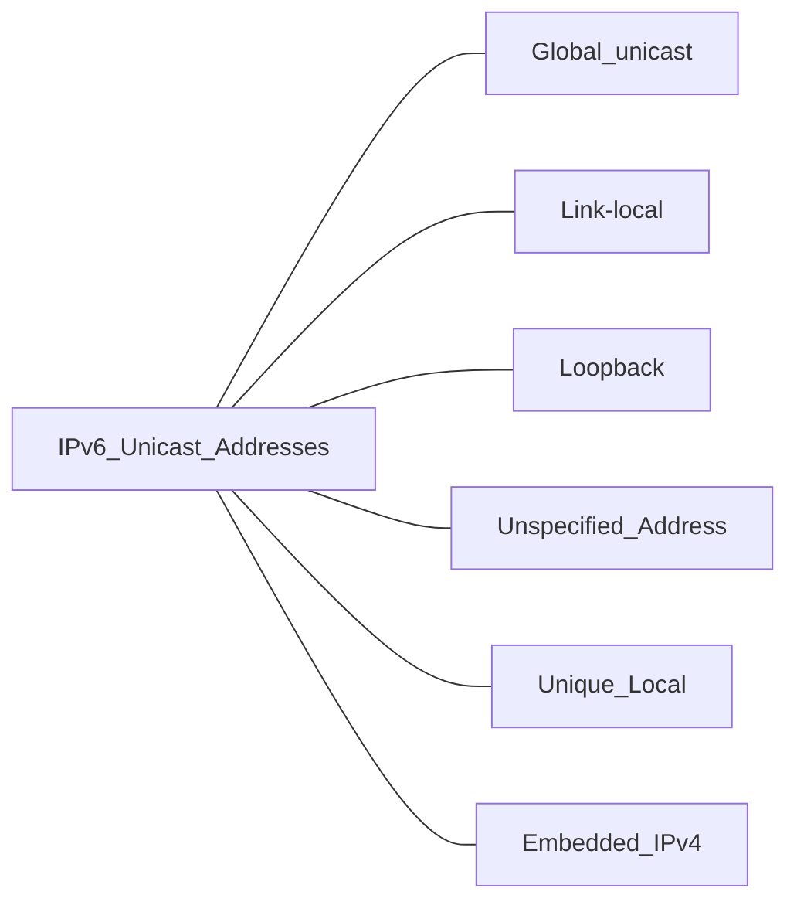

```mermaid
flowchart LR

IPv6_Unicast_Addresses --- Global_unicast & Link-local & Loopback & Unspecified_Address & Unique_Local & Embedded_IPv4
```

# Unicast Addresses

- [Link-local Address (LLA)](Link-local%20Address%20(LLA).md)
- [[Unique Local]]
- [[Global Unicast Address]]
