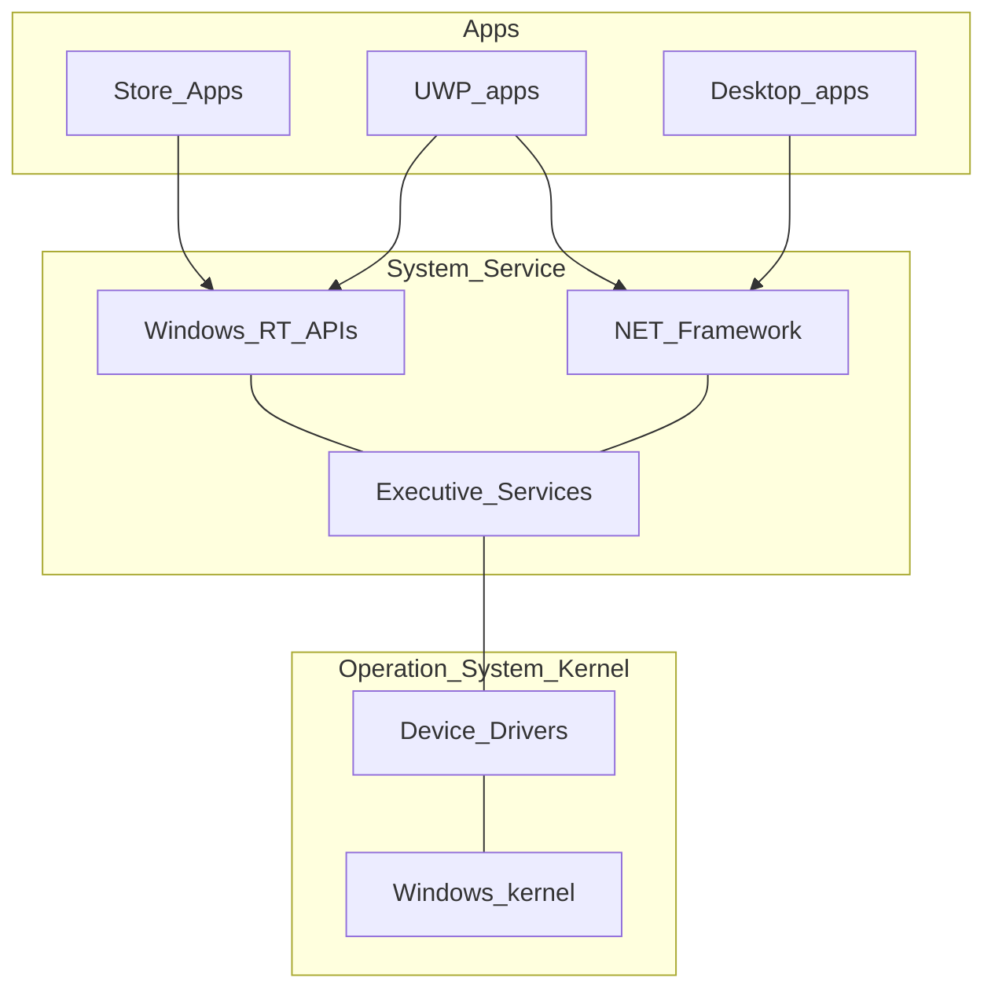
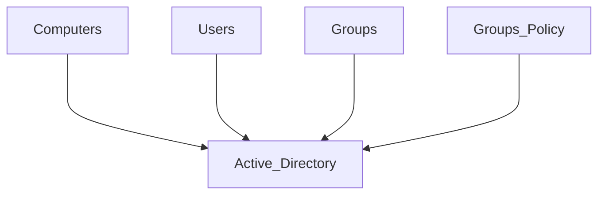

- Apps
- [[System Service]]
- Operating System Kernel

```ad-note
title: Driver

Library that instructs the kernel on service usage. Usually digitally signed through [Hashing](#Hashing), for latest devices.
```


Drivers are **architecture** specific:

- x86 drivers
- x64 drivers

Divided into:

- Setup information (.inf)
- DLLs (.sys)
- Catalogue (.cat)

The CPU architecture is determined by the type of **assembler** used.

```ad-note
title: Assembler

Low level language between High Level Language (compiler) and Machine Language (binary)
```

## Checking Hardware

Microsoft Assessment and Planning Toolkit (MAP) is a software that:
- Scans the network
- Locates all the computers on the network
- Checks hardware compatibility with Win 10
- Requires no agent on any client

## Active Directory
#TODO


