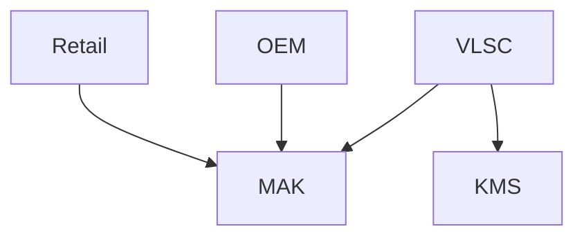

- **Home**: private clients
- **Professional**: small, medium companies
- **Enterprise**: big companies
- **Enterprise LTSB**: execute just Security upgrades (not Function upgrades), mostly used in automation fields
- **Education**: only educational purpose

## Functions

- **BitLocker** (all but Home): Encrypts the hard drive
- **Direct Access** (Enterprise and Educational): the Clients passes through the enterprise's network to access internet
- **AppLocker** (Enterprise and Educational): manages the applications that can and cannot be used
- **BranchCache** (Enterprise and Educational): transfers, manages, sync and store the data from a Server to Client(s)

## Acquisition

Types

- OEM: purchased alongside the device
- Volume Licence (VLSC)

Key Control

- Manual Activation Key
- Key Management System: useful to automatically manage licences on numerous devices
